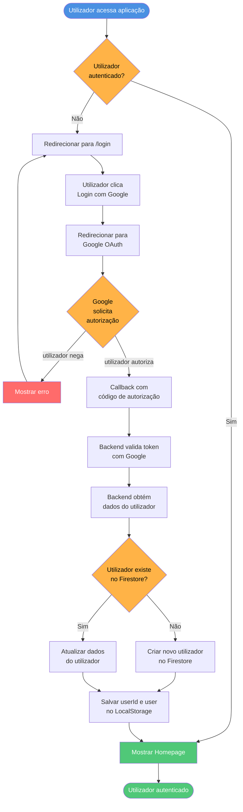
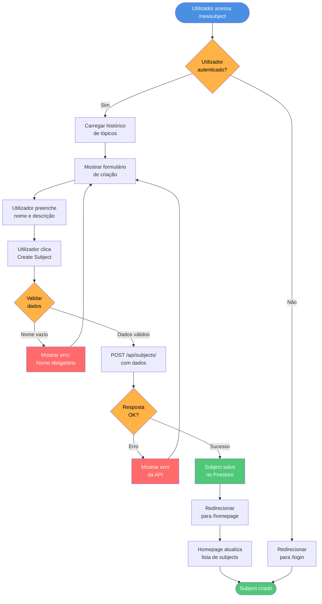
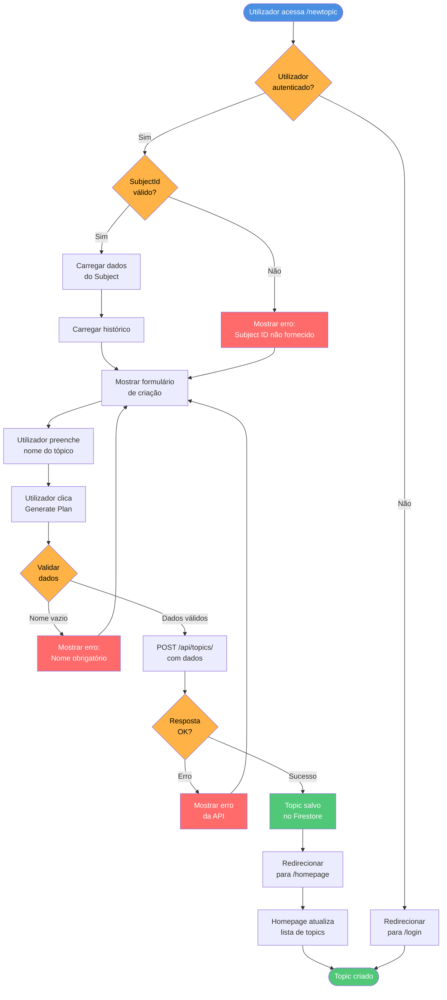
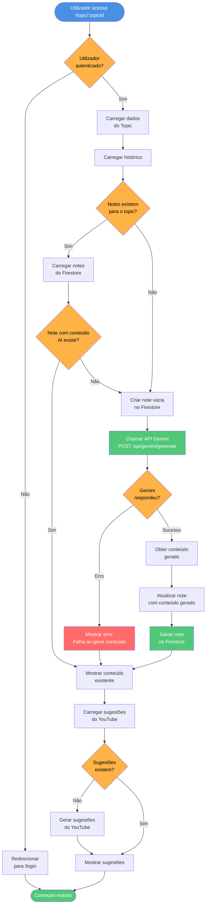
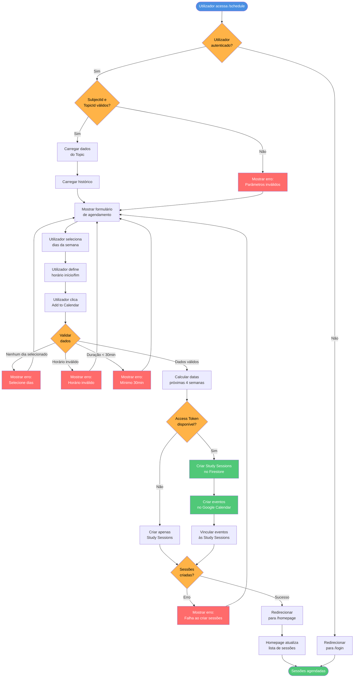
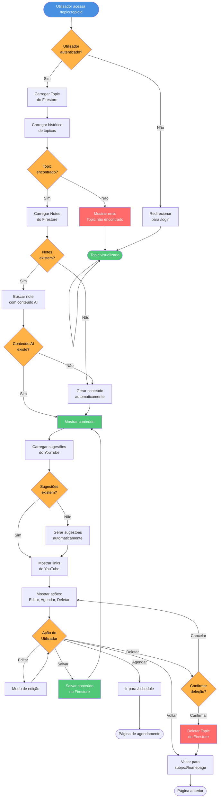
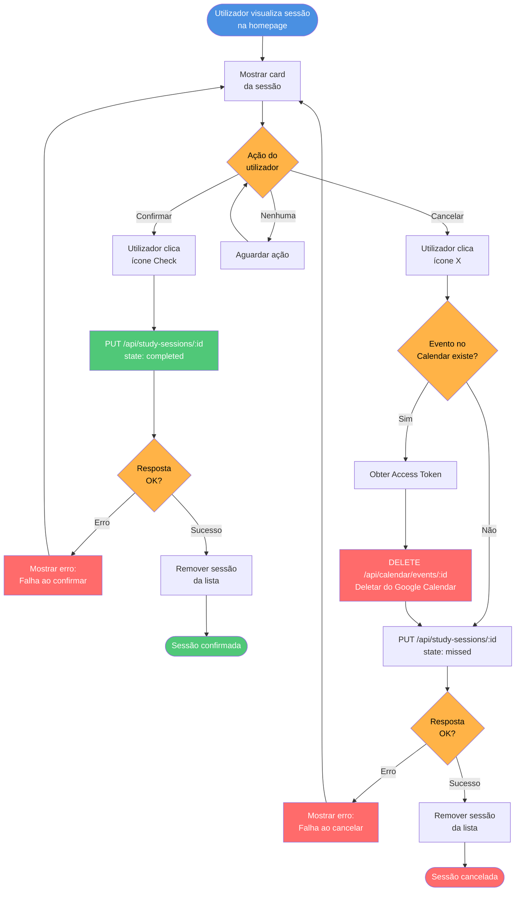
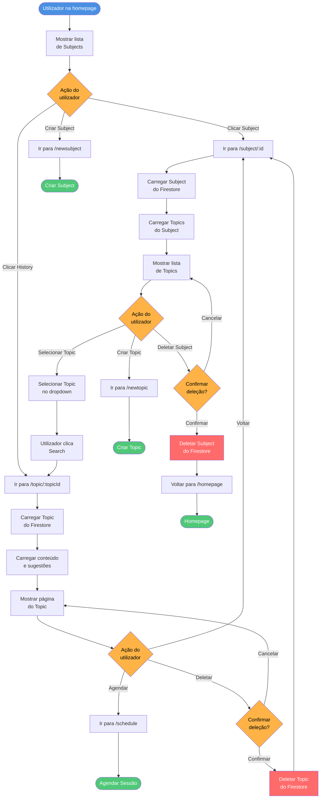

# Diagramas BPMN - BrainBuddy

Este documento contém os diagramas BPMN (Business Process Model and Notation) dos principais processos do sistema BrainBuddy.

---

## Processo de Autenticação/Login

---

## Processo de Criação de Subject

---

## Processo de Criação de Topic

---

## Processo de Geração de Conteúdo com IA

---

## Processo de Agendamento de Sessões de Estudo

---

## Processo de Visualização de Topic

---

## Processo de Confirmação de Sessão de Estudo

---

## 🔍 Processo de Busca e Navegação

---

## Resumo dos Processos

| Processo | Complexidade | Integrações Externas | Principais Decisões |
|----------|--------------|---------------------|---------------------|
| Autenticação/Login | Média | Google OAuth, Firebase | Utilizador existe? |
| Criação de Subject | Baixa | Firebase | Dados válidos? |
| Criação de Topic | Baixa | Firebase | SubjectId válido? |
| Geração de Conteúdo IA | Alta | Gemini API, Firebase | Conteúdo existe? |
| Agendamento de Sessões | Alta | Google Calendar, Firebase | Token disponível? |
| Visualização de Topic | Média | Firebase, Gemini, YouTube | Notes existem? |
| Confirmação de Sessão | Média | Google Calendar, Firebase | Evento existe? |
| Busca e Navegação | Baixa | Firebase | Ação do Utilizador? |

---

