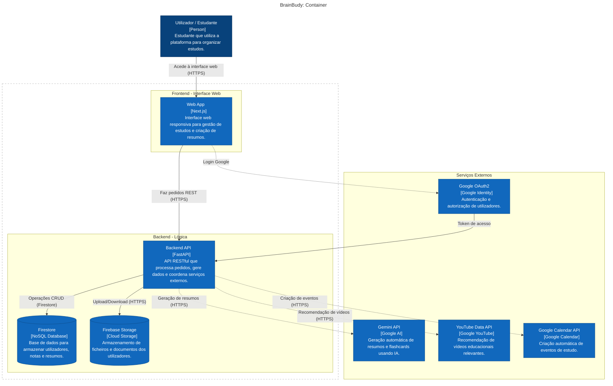

```mermaid
---
config:
  layout: fixed
title: 'BrainBudy: Container'
---
flowchart TB
  subgraph brainbudy-service["BrainBudy"]
    subgraph FRONTEND ["Frontend - Interface Web"]
      WA["Web App 
    [Next.js]
    Interface web responsiva para gestão de estudos e criação de resumos."]
    end

    subgraph BACKEND ["Backend - Lógica"]
      API["Backend API 
    [FastAPI]
    API RESTful que processa pedidos, gere dados e coordena serviços externos."]
      DB[("Firestore
    [NoSQL Database]
    Base de dados para armazenar utilizadores, notas e resumos.")]
      STG[("Firebase Storage
    [Cloud Storage]
    Armazenamento de ficheiros e documentos dos utilizadores.")]
    end
  end

  subgraph GOOGLE ["Serviços Externos"]
    GAI["Gemini API
    [Google AI]
    Geração automática de resumos e flashcards usando IA."]
    YT["YouTube Data API
    [Google YouTube]
    Recomendação de vídeos educacionais relevantes."]
    GCAL["Google Calendar API
    [Google Calendar]
    Criação automática de eventos de estudo."]
    OAUTH["Google OAuth2
    [Google Identity]
    Autenticação e autorização de utilizadores."]
  end

  U["Utilizador / Estudante
  [Person]
  Estudante que utiliza a plataforma para organizar estudos."]

  U -->|"Acede à interface web (HTTPS)"| WA
  WA -->|"Faz pedidos REST (HTTPS)"| API
  WA -.->|"Login Google"| OAUTH
  OAUTH -->|"Token de acesso"| API
  API -->|"Operações CRUD (Firestore)"| DB
  API -->|"Upload/Download (HTTPS)"| STG
  API -.->|"Geração de resumos (HTTPS)"| GAI
  API -.->|"Recomendação de vídeos (HTTPS)"| YT
  API -.->|"Criação de eventos (HTTPS)"| GCAL

  class U person
  class WA,API,DB,STG,FCM,GAI,YT,GCAL,OAUTH container
  
  classDef container fill:#1168bd,stroke:#0b4884,color:#ffffff
  classDef person fill:#08427b,stroke:#052e56,color:#ffffff
  style brainbudy-service fill:none,stroke:#CCC,stroke-width:2px,color:#fff,stroke-dasharray: 5 5

```