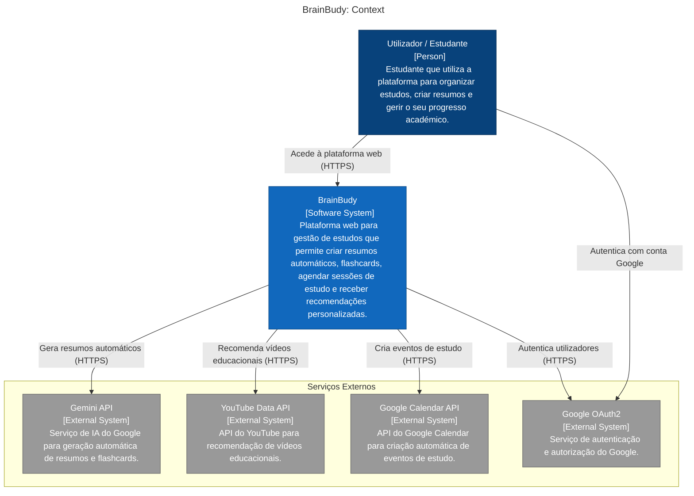

```mermaid
---
config:
  layout: fixed
title: 'BrainBudy: Context'
---
flowchart TB
  U["Utilizador / Estudante
  [Person]
  Estudante que utiliza a plataforma para organizar estudos, criar resumos e gerir o seu progresso académico."]

  BB["BrainBudy
  [Software System]
  Plataforma web para gestão de estudos que permite criar resumos automáticos, flashcards, agendar sessões de estudo e receber recomendações personalizadas."]

  subgraph GOOGLE ["Serviços Externos"]
    GAI["Gemini API
    [External System]
    Serviço de IA do Google para geração automática de resumos e flashcards."]
    YT["YouTube Data API
    [External System]
    API do YouTube para recomendação de vídeos educacionais."]
    GCAL["Google Calendar API
    [External System]
    API do Google Calendar para criação automática de eventos de estudo."]
    OAUTH["Google OAuth2
    [External System]
    Serviço de autenticação e autorização do Google."]
  end

  U -->|"Acede à plataforma web (HTTPS)"| BB
  U -->|"Autentica com conta Google"| OAUTH
  BB -->|"Gera resumos automáticos (HTTPS)"| GAI
  BB -->|"Recomenda vídeos educacionais (HTTPS)"| YT
  BB -->|"Cria eventos de estudo (HTTPS)"| GCAL
  BB -->|"Autentica utilizadores (HTTPS)"| OAUTH

  class U person
  class BB system
  class GAI,YT,GCAL,OAUTH external
  
  classDef person fill:#08427b,stroke:#052e56,color:#ffffff
  classDef system fill:#1168bd,stroke:#0b4884,color:#ffffff
  classDef external fill:#999999,stroke:#666666,color:#ffffff
```

