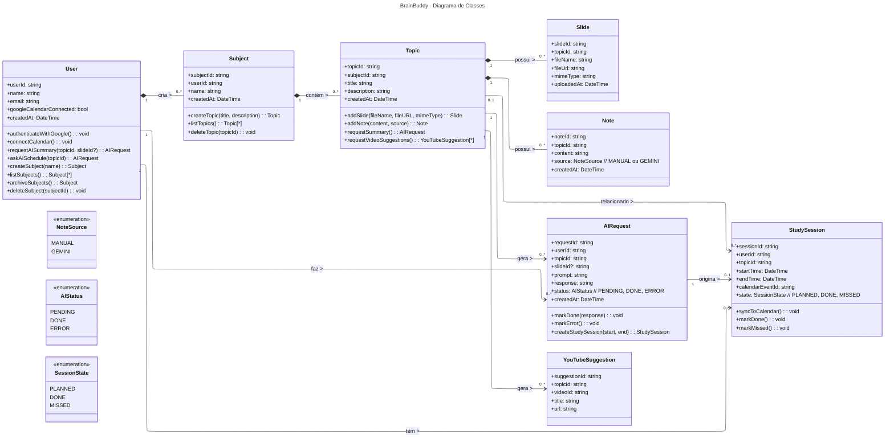

```mermaid
---
title: "BrainBuddy - Diagrama de Classes"
config:
  layout: elk
---

classDiagram
direction LR

%% ======================
%% CLASSES PRINCIPAIS
%% ======================

class User {
  +userId: string
  +name: string
  +email: string
  +googleCalendarConnected: bool
  +createdAt: DateTime
  
  +authenticateWithGoogle(): void
  +connectCalendar(): void
  +requestAISummary(topicId, slideId?): AIRequest
  +askAISchedule(topicId): AIRequest
  +createSubject(name): Subject
  +listSubjects(): Subject[*]
  +archiveSubjects(): Subject
  +deleteSubject(subjectId): void
}

class Subject {
  +subjectId: string
  +userId: string
  +name: string
  +createdAt: DateTime
  
  +createTopic(title, description): Topic
  +listTopics(): Topic[*]
  +deleteTopic(topicId): void
}

class Topic {
  +topicId: string
  +subjectId: string
  +title: string
  +description: string
  +createdAt: DateTime

  +addSlide(fileName, fileURL, mimeType): Slide
  +addNote(content, source): Note
  +requestSummary(): AIRequest
  +requestVideoSuggestions(): YouTubeSuggestion[*]
}

class Slide {
  +slideId: string
  +topicId: string
  +fileName: string
  +fileUrl: string
  +mimeType: string
  +uploadedAt: DateTime
}

class Note {
  +noteId: string
  +topicId: string
  +content: string
  +source: NoteSource // MANUAL ou GEMINI
  +createdAt: DateTime
}

class AIRequest {
  +requestId: string
  +userId: string
  +topicId: string
  +slideId?: string
  +prompt: string
  +response: string
  +status: AIStatus // PENDING, DONE, ERROR
  +createdAt: DateTime

  +markDone(response): void
  +markError(): void
  +createStudySession(start, end): StudySession
}

class StudySession {
  +sessionId: string
  +userId: string
  +topicId: string
  +startTime: DateTime
  +endTime: DateTime
  +calendarEventId: string
  +state: SessionState // PLANNED, DONE, MISSED

  +syncToCalendar(): void
  +markDone(): void
  +markMissed(): void
}

class YouTubeSuggestion {
  +suggestionId: string
  +topicId: string
  +videoId: string
  +title: string
  +url: string
}

%% ======================
%% RELAÇÕES E CARDINALIDADES
%% ======================

User "1" *-- "0..*" Subject : cria >
Subject "1" *-- "0..*" Topic : contém >
Topic "1" *-- "0..*" Slide : possui >
Topic "1" *-- "0..*" Note : possui >
User "1" --> "0..*" AIRequest : faz >
Topic "1" --> "0..*" AIRequest : gera >
AIRequest "1" --> "0..1" StudySession : origina >
User "1" --> "0..*" StudySession : tem >
Topic "0..1" --> "0..*" StudySession : relacionado >
Topic "1" --> "0..*" YouTubeSuggestion : gera >

%% ======================
%% ENUMS / TIPOS
%% ======================

class NoteSource {
  <<enumeration>>
  MANUAL
  GEMINI
}

class AIStatus {
  <<enumeration>>
  PENDING
  DONE
  ERROR
}

class SessionState {
  <<enumeration>>
  PLANNED
  DONE
  MISSED
}
```