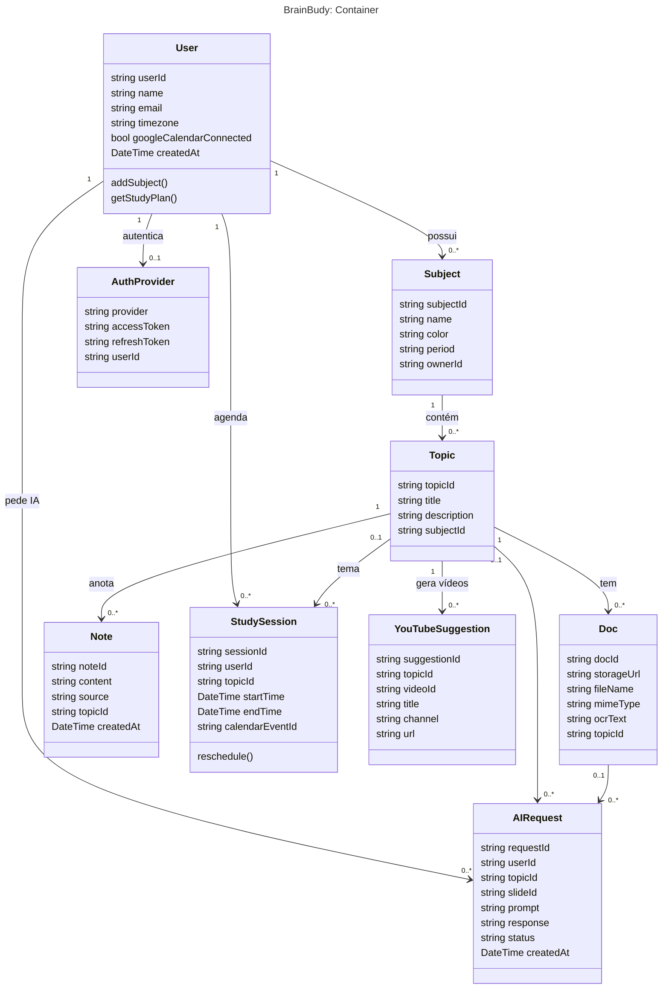

```mermaid
---
config:
  layout: fixed
title: 'BrainBudy: Container'
---
classDiagram
    class User {
      string userId
      string name
      string email
      string timezone
      bool googleCalendarConnected
      DateTime createdAt
      addSubject()
      getStudyPlan()
    }

    class Subject {
      string subjectId
      string name
      string color
      string period
      string ownerId
    }

    class Topic {
      string topicId
      string title
      string description
      string subjectId
    }

    class Doc {
      string docId
      string storageUrl
      string fileName
      string mimeType
      string ocrText
      string topicId
    }

    class Note {
      string noteId
      string content
      string source
      string topicId
      DateTime createdAt
    }

    class StudySession {
      string sessionId
      string userId
      string topicId
      DateTime startTime
      DateTime endTime
      string calendarEventId
      reschedule()
    }

    class AIRequest {
      string requestId
      string userId
      string topicId
      string slideId
      string prompt
      string response
      string status
      DateTime createdAt
    }

    class YouTubeSuggestion {
      string suggestionId
      string topicId
      string videoId
      string title
      string channel
      string url
    }

    class AuthProvider {
      string provider
      string accessToken
      string refreshToken
      string userId
    }

    User "1" --> "0..*" Subject : possui
    Subject "1" --> "0..*" Topic : contém
    Topic "1" --> "0..*" Doc : tem
    Topic "1" --> "0..*" Note : anota
    User "1" --> "0..*" StudySession : agenda
    Topic "0..1" --> "0..*" StudySession : tema
    User "1" --> "0..*" AIRequest : pede IA
    Topic "0..1" --> "0..*" AIRequest
    Doc "0..1" --> "0..*" AIRequest
    Topic "1" --> "0..*" YouTubeSuggestion : gera vídeos
    User "1" --> "0..1" AuthProvider : autentica

```